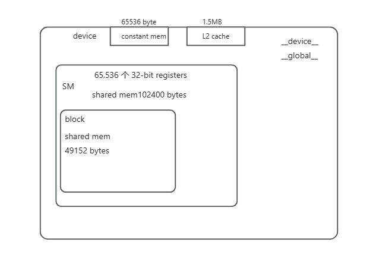
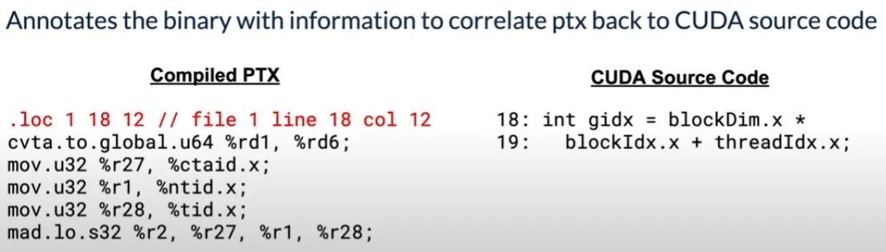

# Autodidactic_ParallelismComp_Notes

这个项目是学习cuda并行编程时的一些笔记，用作备忘。<br>
<br>

## CUDA 基础


## CUDA 高性能编程细节Note
>>nvcc kernel.cu -o MatMul.exe -lcublas
### 模板
#include "cuda_runtime.h" <br>
#include "device_launch_parameters.h"<br>
cudaStatus = cudaDeviceReset();  // for nvprofile 记录完整 <br>
### 卡性能
```cpp
#include "cuda_runtime.h"
#include "device_launch_parameters.h"
int main()
{
    cudaDeviceProp deviceProp;
    cudaGetDeviceProperties(&deviceProp, 0);
    printf("设备名称与型号: %s\n", deviceProp.name);
    printf("显存大小: %d MB\n", (int)(deviceProp.totalGlobalMem / 1024 / 1024));
    printf("含有的SM数量: %d\n", deviceProp.multiProcessorCount);
    printf("CUDA CORE数量: %d\n", deviceProp.multiProcessorCount * 192);
    printf("计算能力: %d.%d\n", deviceProp.major, deviceProp.minor);
}
```
以我的一块3050为例：<br>
```
Total amount of constant memory:               65536 bytes
Total amount of shared memory per block:       49152 bytes
Total shared memory per multiprocessor:        102400 bytes
```
### hard-ware
#### 总结图
<br>
1. 关于怎么看 是 mem bound 还是 compute bound 的问题。
  a. 如果测试，可以用 看 profile / source  code modification 的方式。
    ⅰ. 关注一下 sm_efficiency， 可用 nvprof -e 测这个指标 ：为 active_cycles/elapsed_cycles 。
    ⅱ. sm_efficiency 可以用 occupancy 优化；
    ⅲ. 此外，low sm_efficiency 可能由错误的configuration 导致。如10个SM由于错误的 configuration 导致只能在一个 SM 上面跑。
  b. 要算 memory system performance    和    compute instruction throughput

2. Intermediate data structure 应当在 device memory 中创建，不要传到host。device mem 和 GPU 之间的传输，以Tesla V100 为例，为898GB/s。 host -》device 则是根据 PCIe 来的，16GB。
3. __device___  __global___ 都可以被设备访问，一般不定义大核global func，因为用 global 调用多个小核更加容易测试。  __device___ float GetElement(...);
4.  Effective bandwidth 是自己看代码算出的，如从global mem 中读取了多少，加写回了多少； profile 中可以直接看 Global Memory efficiency 百分比； actual memory access 看 Global Load Throughput 和 Global Store Throughput values 指标。
  ○ Requested Global Load Throughput  和  Requested Global Store Throughput 两个指标等于算出的 Effective bandwidth，其与Global Memory efficiency的比值，反应了有多少bandwidth 被coalsced memory 访问问题浪费了。
5. Global memory is visible to all threads in the GPU. Global memory is accessed through the SM L1 and GPU L2
6. global mem 是指存在 设备 DRAM中的部分，可以用 __device___ 来申明，或者直接  cudaMalloc() 申请的就是global 的mem。global mem 的生命周期持续整个 application期间。
7.  A warp is referred to as active or resident when it is mapped to a sub partition. A sub partition manages a fixed size pool of warps. On Volta architectures, the size of the pool is 16 warps. On Turing architectures the size of the pool is 8 warps. Each sub partition has a set of 32-bit registers.
8. Local memory addresses are translated to global virtual addresses by the the AGU unit
9. warp有多种停滞原因，以及warp的状态参考：See Warp Scheduler States for the list of stall reasons that can be profiled and the Warp State Statistics section for a summary of warp states found in the kernel execution.
10. Local memory has the same latency as global memory.？：，原因见 18.
11.  global and local memory 的一个区别： local memory is arranged such that consecutive 32-bit words are accessed by consecutive thread IDs. Accesses are therefore fully coalesced as long as all threads in a warp access the same relative address (e.g., same index in an array variable, same member in a structure variable, etc.).意思即：local mem 的访问是完全连续的。
12. Shared memory has 32 banks。 任何访问连续32个distinct memory banks 之内的存储空间，都能够被同时满足：Any 32-bit memory read or write request made of 32 addresses that fall in 32 distinct memory banks can therefore be serviced simultaneously.
13. shared mem:  每一个bank每个  cycle 有32bit 的带宽。 and successive 32-bit words are assigned to successive banks.
14. 但是，如果是同一warp中的线程访问同一个32-bit地址（如果是不同的地址，相同的bank，即跨了32个32-bit 则不行），是可以在一个周期内完成的，竞争读会分发，竞争写会不知道最后哪个写进去：A shared memory request for a warp does not generate a bank conflict between two threads that access any address within the same 32-bit word (even though the two addresses fall in the same bank). When multiple threads make the same read access, one thread receives the data and then broadcasts it to the other threads. When multiple threads write to the same location, only one thread succeeds in the write; which thread that succeeds is undefined.
15.  L1 data cache, shared data, and the Texture data cache are one and the same。
16. Texture and surface memory space resides in device memory and are cached in L1。
17. L2 cache 是用于访问 main mem 的。
18. The L1 cache is optimized for 2D spatial locality, so threads of the same warp that read texture or surface addresses that are close together in 2D space will achieve optimal performance
19. 关于 nsight comput 中 metrics 中的指标：https://docs.nvidia.com/nsight-compute/ProfilingGuide/index.html#metrics-decoder

15. 两个最重要的优化事项：给 GPU 足够多的并行任务、有效使用显存子系统。我们将着重于第二个目标。因为我们仅使用了全局存储器，因此我们的重点是如何有效的使用全局存储器，为此我们需要尽量对全局存储器进行读/写联合操作。
在 Visual Profiler (nvvp) 或 nvprof 中，可以使用 gld_efficiency （全局读取效率）和 gst_efficiency （全局写入效率）等指标，可以轻松的验证全局存储器的访问是否已经合并。
16. https://www.cnblogs.com/chenjambo/articles/using-nsight-compute-to-inspect-your-kernels.html 上说：
https://docs.nvidia.com/nsight-compute/NsightComputeCli/index.html#nvprof-guide 记录了nvvp 到 nsignt compute 之间的指标转换。

17. 矩阵优化，关于是否是同一个warp 读写 是否需要用__syncthreads() 还是就 __syncwarps() 就行的区别可能还要看看：https://docs.nvidia.com/cuda/cuda-c-best-practices-guide/index.html#shared-memory-in-matrix-multiplication-c-ab__improvement-reading-additional-data-shared-memory 

18. local memory 是 off-chip 的，跟global mem的访问延迟一样高，但的确 是仅thread 内部可见的。    (nvcc 编译时加 -ptx or -keep ) 可以看到 PTX assembly code，看variable 在不在local memory，during the first compilation phases. 在local mem 中的会标记 .local mnemonic， 用 ld.local 和 st.local mnemonics访问。只有在消耗了太多register时，编译器才会放入local  mem。 虽然不能够方便的看是否消耗了太多哦register，但是编译选项 --ptxas-options=-v 可以看每个kernel用了多少reigster。

19. 当使用Texture object中的 tex1D(), tex2D(), or tex3D() 而非 tex1Dfetch() 时，有额外的便利：https://docs.nvidia.com/cuda/cuda-c-best-practices-guide/index.html#additional-texture-capabilities    
其中包括 方便使用 无视 resolution 的归一化texture coordinate； 超出边界的部分 clamp（超出部分为0） 	and wrap（从头开始） 
20. 注意一个thread可以安全的读取 经过之前调用的kernel或global copy 操作改变的texture 内存，但是读取本kernel中的其他thread 改写的texture 内存，则会读到不可预计的结果。
21. There is a total of 64 KB constant memory on a device

22. 一般访问register的每个指令是不消耗cycle 的， 但是 read-after-write dependencies 和 bank conflict 可能会导致延迟
23. CUDA原文显示：没有与寄存器相关的理由将数据打包成向量数据类型，如float4或int4类型。因为compiler会最大程度的避免register bank conflict。
24. cudaMalloc() and cudaFree() 是昂贵的操作，因此开的内存应该充分重复利用，或者 sub-allocation。

25. L2 cache 这部分没有搞懂，需要再整理：https://docs.nvidia.com/cuda/cuda-c-best-practices-guide/index.html#L2-cache
26. 把读写global mem降到最低，就算代码有高throughput，但访问global 或 local 本身需要几百个cycle，latency很高。尽量降低读写global mem，并且通过实验确定用多少 independent arithmetic instructions 把访问延迟覆盖掉。

27. 倒数平方都用  rsqrtf() for single precision and rsqrt()。	 各种fraction 导数用这些替代，不要用pow：https://docs.nvidia.com/cuda/cuda-c-best-practices-guide/index.html#exponentiation-small-fractions
28. compute capability:   deviceQuery CUDA Sample.  或者调用 cudaGetDeviceProperties() and accessing the information in the structure it returns.

29. 由于CUDA thread 内部的instruction 是线性执行的。因此，在一个warp等待时，执行其他的warp 是唯一消除latency带来的hardware闲置 的方法。 occupancy  metric 中显示当前SM的跟active warp 数目有关的指标，都是衡量harware多 busy 的重要指标。 
30. Occupancy is the ratio of the number of active warps per multiprocessor。 一个SM中最大有多少个warp能够active 可以通过 deviceQuery CUDA Sample 查看。
31. Higher occupancy 并不总意味着高performence。However, low occupancy always interferes with（干扰） the ability to hide memory latency, resulting in performance degradation.
32. 为了保证一个block要的资源太多，导致一个SM上连一个 block 都启动不起来，出现"too many resources requested for launch" errors。 设计者可以include the single argument __launch_bounds__(maxThreadsPerBlock)  但这个怎么用，需要找一个例子：？
33. The maximum number of registers per thread can be set manually at compilation time per-file using the -maxrregcount option or per-kernel using the __launch_bounds__ qualifier (see Register Pressure).
34.   compute capability 7.0 之上的设备每个 multiprocessor 有 65,536 个 32-bit registers ，且最多launch 2048 simultaneous threads resident (64 warps x 32 threads per warp)。 设计的时候考虑每个SM上lauch 的线程来看，每个线程最多用多少register，保证register 不会导致SM上lauch 的block数下降。
35. 但是光考虑把34中的“把每个register用起来”也是不够的。还要考虑 register 的使用粒度。比如：a kernel with 128-thread blocks using 37 registers per thread results in an occupancy of 75% with 12 active 128-thread blocks per multi-processor, whereas a kernel with 320-thread blocks using the same 37 registers per thread results in an occupancy of 63% because only four 320-thread blocks can reside on a multiprocessor。 65536/128*37 = 13.837837837837839； 65536/320/37 = 5.535135135135135。
<br>
<br>
>例题：对sm进行计算，看理论上有多少个block 可以 resident：假设每个thread 用45个register
如果每block 128 thread ，那么一个block 耗费 128*45=4096 个 register，一个SM理论上能放11个block，
11个block是11*128=1408个thread. 大概，注意是大概理论上每个SM上能resident 1408 个thread，相对与能驻留的最大线程数1524 个，大概occupancy 预测的是 92%。<br>

36. 此外还有一点需要注意： compute capability 7.0的设备会将每个block 所用的寄存器个数 round up to 最接近的256的整数倍，所以block最少使用256各个register或者0个（如果过不用的话）。
37. 编译时可用 --ptxas options=v 的 nvcc 选项看每个kernel用的 registers 数目。
38. 关于CUDA 指令集：https://www.cnblogs.com/wujianming-110117/p/15037868.html<br>
  a. https://developer.nvidia.com/gpugems/gpugems/part-v-performance-and-practicalities/chapter-28-graphics-pipeline-performance<br>
  b. https://raytracing-docs.nvidia.com/nvindex/reference/examples/cluster__rendering__remotehost_8cpp_source.html

39. 次要考虑：Register dependencies arise when an instruction uses a result stored in a register written by an instruction before it. The latency of most arithmetic instructions is typically 4 cycles on devices of compute capability 7.0. So threads must wait approximatly 4 cycles before using an arithmetic result. However, this latency can be completely hidden by the execution of threads in other warps. 

40.   threads \每block 应该是 32 的整数倍, because this provides optimal computing efficiency and facilitates coalescing。
41. 举例，occupancy从66%到100%可能性能不会有相应的提升。原因如：每个thread register不够用而去申请local memory 的例子变多。 关于如何确定block size 有几条需要follow 的general tips（具体通过那个xls算，还要实验尝试确定）：<br>
  a. Threads per block should be a multiple of warp size<br>
  b. 每个块至少应使用64个线程，并且仅当每个多处理器有多个并发块时<br>
  c. 128 ~ 256 threads per block 是开始尝试的好区间<br>
  d. 每SM用多个小block，而不用一个大block；尤其对于调用__syncthreads() 的kernel。<br>

42. when a thread block allocates more registers than are available on a multiprocessor, the kernel launch fails, as it will when too much shared memory or too many threads are requested
43. 一个有时很有用的tricks：A useful technique to determine the sensitivity of performance to occupancy is through experimentation with the amount of dynamically allocated shared memory, as specified in the third parameter of the execution configuration. By simply increasing this parameter (without modifying the kernel), it is possible to effectively reduce the occupancy of the kernel and measure its effect on performance.
44. concurent execution 只要 Non-default streams。因为default stream 中的kernel，只在所有其他stream 的kernel都运行完了才能执行，且default stream 中的kernel执行完后其他stream的kernel才能执行。
```cpp
// 必须没有 default stream 
cudaStreamCreate(&stream1);
cudaStreamCreate(&stream2);
kernel1<<<grid, block, 0, stream1>>>(data_1);
kernel2<<<grid, block, 0, stream2>>>(data_2);
```

44. 可以检查是否程序跑到了malloc的内存之外的地址（超出），或者其他 memory error， 用 cuda-memcheck    ./my-cuda-binary
45.  <br>
用 -lineinfo 不会损失 performance，且使得debugging 更加简单。会在PTX编译中出现如下的注释：<br>
<br>
46. 不要使用 nvcc 的编译选项（与nvprof和nsight comput无关）：--profile(是gprof的)； --debug（我们是看device code，这是活的host code 的）；--device-debug（performance骤降）。
47. Profile 会 降低 performance，只是用来分析的。要看实际performance 要profile 再跑一遍。（多跑几遍取后几次的平均，前面是warmup）<br>
48. <br>

##### 矩阵为例：
1. 对于计算密集型的kernel，SM中可能产生Register bank conflict。<br>