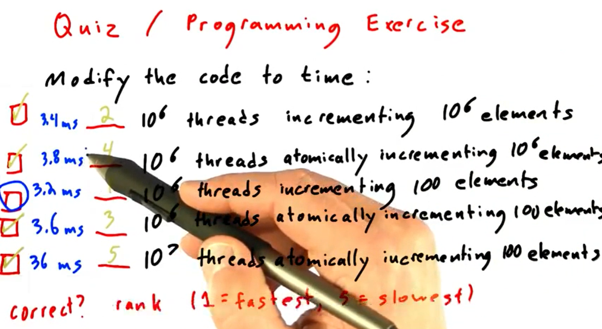

# CUDA 基础

## 开场白
### 理解矩阵
1.由很多（实际上是无穷多个）位置点组成；2. 这些点之间存在相对的关系；3. 可以在空间中定义长度、角度；4. 这个空间可以容纳运动，这里我们所说的运动是从一个点到另一个点的移动（变换），而不是微积分意义上的“连续”性的运动，
第四个特诊才是空间的本质特征，容纳运动是空间的本质特征。

事实上，不管是什么空间，都必须容纳和支持在其中发生的符合规则的运动（变换）。你会发现，在某种空间中往往会存在一种相对应的变换，比如拓扑空间中有拓扑变换，线性空间中有线性变换，仿射空间中有仿射变换，其实这些变换都只不过是对应空间中允许的运动形式而已。
“空间”是容纳运动的一个对象集合，而变换则规定了对应空间的运动。
但是既然我们承认线性空间是个空间，那么有两个最基本的问题必须首先得到解决，那就是：
1. 空间是一个对象集合，线性空间也是空间，所以也是一个对象集合。那么线性空间是什么样的对象的集合？或者说，线性空间中的对象有什么共同点吗？
2. 线性空间中的运动如何表述的？也就是，线性变换是如何表示的？
直接给答案：线性空间中的任何一个对象，通过选取基和坐标的办法，都可以表达为向量的形式。
值得说的：基的选取，只要线性无关就行
关于问题1，举两个特殊的例子：<br>
>L1. 最高次项不大于n次的多项式的全体构成一个线性空间，也就是说，这个线性空间中的每一个对象是一个多项式。如果我们以x0, x1, ..., xn为基，那么任何一个这样的多项式都可以表达为一组n+1维向量，其中的每一个分量ai其实就是多项式中x(i-1)项的系数。值得说明的是，基的选取有多种办法，只要所选取的那一组基线性无关就可以。这要用到后面提到的概念了，所以这里先不说，提一下而已。<br>
L2. 闭区间[a, b]上的n阶连续可微函数的全体，构成一个线性空间。也就是说，这个线性空间的每一个对象是一个连续函数。对于其中任何一个连续函数，根据魏尔斯特拉斯定理，一定可以找到最高次项不大于n的多项式函数，使之与该连续函数的差为0，也就是说，完全相等。这样就把问题归结为L1了。后面就不用再重复了。
关于问题2：
简而言之，在线性空间中选定基之后，向量刻画对象，矩阵刻画对象的运动，用矩阵与向量的乘法施加运动。

#### 矩阵是线性空间里的变换的描述。
设有一种变换T，使得对于线性空间V中间任何两个不相同的对象x和y，以及任意实数a和b，有：
T(ax + by) = aT(x) + bT(y)，
那么就称T为线性变换。

一个点不仅可以变换到同一个线性空间中的另一个点，而且可以变换到另一个线性空间中的另一个点去。不管你怎么变，只要变换前后都是线性空间中的对象，这个变换就一定是线性变换，也就一定可以用一个非奇异矩阵来描述。所谓非奇异，只对方阵有意义，那么非方阵的情况怎么样？这个说起来就会比较冗长了，最后要把线性变换作为一种映射，并且讨论其映射性质，以及线性变换的核与像等概念才能彻底讲清楚。
以下我们只探讨最常用、最有用的一种变换，就是在同一个线性空间之内的线性变换。也就是说，下面所说的矩阵，不作说明的话，就是方阵，而且是非奇异方阵。
矩阵是线性空间中的线性变换的一个描述。在一个线性空间中，只要我们选定一组基，那么对于任何一个线性变换，都能够用一个确定的矩阵来加以描述。

#### 那么如何知道两个矩阵是同一个线性变换的描述呢？
若矩阵A与B是同一个线性变换的两个不同的描述（之所以会不同，是因为选定了不同的基，也就是选定了不同的坐标系），则一定能找到一个非奇异矩阵P，使得A、B之间满足这样的关系：<br>
$A= P^{-1} B P$  <br>
所谓相似矩阵，就是同一个变换的不同描述矩阵

！！：矩阵不仅可以作为线性变换的描述，而且可以作为一组基的描述。而作为变换的矩阵，不但可以把线性空间中的一个点给变换到另一个点去，而且也能够把线性空间中的一个坐标系（基）表换到另一个坐标系（基）去。而且，变换点与变换坐标系，具有异曲同工的效果。线性代数里最有趣的奥妙，就蕴含在其中。理解了这些内容，线性代数里很多定理和规则会变得更加清晰、直觉。

总结：
1. 首先有空间，空间可以容纳对象运动的。一种空间对应一类对象。
2. 有一种空间叫线性空间，线性空间是容纳向量对象运动的。
3. 运动是瞬时的，因此也被称为变换。
4. 矩阵是线性空间中运动（变换）的描述。
5. 矩阵与向量相乘，就是实施运动（变换）的过程。
6. 同一个变换，在不同的坐标系下表现为不同的矩阵，但是它们的本质是一样的，所以本征值相同。

如果一组向量是彼此线性无关的话，那么它们就可以成为度量这个线性空间的一组基
看上去矩阵就是由一组向量组成的，而且如果矩阵非奇异的话（我说了，只考虑这种情况），那么组成这个矩阵的那一组向量也就是线性无关的了，也就可以成为度量线性空间的一个坐标系。结论：矩阵描述了一个坐标系。
固定坐标系下一个对象的变换等价于固定对象所处的坐标系变换

#### 理解矩阵相乘：
Ma = b  <br>
可以理解为：向量a经过矩阵M所描述的变换，变成了向量b
第二种理解方式：有一个向量，它在坐标系M的度量下得到的度量结果向量为a，那么它在坐标系I的度量下，这个向量的度量结果是b（ 这里的I是指单位矩阵，就是主对角线是1，其他为零的矩阵）<br>
在M为坐标系的意义下，如果把M放在一个向量a的前面，形成Ma的样式，我们可以认为这是对向量a的一个环境声明<br>
注意到，M矩阵表示出来的那个坐标系，由一组基组成，而那组基也是由向量组成的，同样存在这组向量是在哪个坐标系下度量而成的问题。也就是说，表述一个矩阵的一般方法，也应该要指明其所处的基准坐标系。所谓M，其实是 IM，也就是说，M中那组基的度量是在 I 坐标系中得出的。从这个视角来看，M×N也不是什么矩阵乘法了，而是声明了一个在M坐标系中量出的另一个坐标系N，其中M本身是在I坐标系中度量出来的。<br>
再一次的，矩阵的乘法变成了运动的施加。只不过，被施加运动的不再是向量，而是另一个坐标系。<br>

如果你觉得你还搞得清楚，请再想一下刚才已经提到的结论，矩阵MxN，一方面表明坐标系N在运动M下的变换结果，另一方面，把M当成N的前缀，当成N的环境描述，那么就是说，在M坐标系度量下，有另一个坐标系N。这个坐标系N如果放在I坐标系中度量，其结果为坐标系MxN。<br>
重要总结：
1. 从变换的观点看，对坐标系N施加M变换，就是把组成坐标系N的每一个向量施加M变换。

2. 从坐标系的观点看，在M坐标系中表现为N的另一个坐标系，这也归结为，对N坐标系基的每一个向量，把它在I坐标系中的坐标找出来，然后汇成一个新的矩阵。

3. 至于矩阵乘以向量为什么要那样规定，那是因为一个在M中度量为a的向量，如果想要恢复在I中的真像，就必须分别与M中的每一个向量进行內积运算。我把这个结论的推导留给感兴趣的朋友吧。应该说，其实到了这一步，已经很容易了。

还留下一个行列式的问题。矩阵M的行列式实际上是组成M的各个向量按照平行四边形法则搭成一个n维立方体的体积。


## TensorFlow 中 求 jacobian 矩阵
jacobian(    target,    sources,    unconnected_gradients=tf.UnconnectedGradients.NONE,    parallel_iterations=None,    experimental_use_pfor=True)

Args:
1. target：A tensor (or list of tensor) with shape [y1, ... ,yn].
2. sources: A tensor (or list of tensor) with shape [x1, ... ,xm].
3. unconnected_gradients: 类似tape.gradient()中的介绍。
4. parallel_iterations: jacobian的求解中，实际上是含有 while_loop 循环的，而该参数则是允许并行执行的循环个数。该参数将影响内存占用。
5. experimental_use_pfor:
    True（默认） : 使用向量化的方法（pfor）计算 jacobian（vectorizes the jacobian computation）<br>
    False : 使用 while_loop 方法计算。<br>
    一般来说，向量化能加速计算，但向量化占用的内存远高于 while_loop 。

Returns:
A tensor (or list of tensor) with shape [y1, ..., yn, x1, ..., xm]。<br>
【重点】实际上就是先将 sources x 和 target y “打平”成  [y1 × ... × yn]和  [x1 × ... × xm]，求取其 jacobian 矩阵后  [y1 × ... × yn, x1 × ... × xm]，再 reshape 成 [y1, ... ,yn, x1, ..., xm] 形式
``` python
with tf.GradientTape() as g:
    x = tf.constant(np.random.rand(100, 10, 3))
    W = tf.constant(np.random.rand(100, 3, 5))
    g.watch(x)
    y = x @ W
jacobian = g.jacobian(y, x)

print(jacobian.shape)  # (100, 10, 5, 100, 10, 3)
```

## jax & jax auto differentiation
跟主题暂时无关，之后再搬过来

## CUDA
### first example:
``` cpp
//__global__的作用：告诉编译器这个函数是nvcc编的，而不是C++函数
__global__ cube(float* d_in, float* d_out){		
    int index = threadIdx.x;		//threadIdx是
    float tmp = d_in[indx];
    d_out[index] = tmp*tmp*tmp;
}
```
``` cpp
int main(int argc, char** argv){
    const int ARRAY_SIZE = 64;
    const int ARRAY_BYTES = ARRAY_SIZE*sizeof(float);
    // 在host中定义输入
    float h_in[ARRAY_SIZE]{};
    float h_out[ARRAY_SIZE]{};
    for (int i=0; i<ARRAY_SIZE;i++){
        h_in = i;
    }
    // 在device上开辟相应空间
    float *d_in;
    float *d_out;
    cudaMalloc((void**)&d_in, ARRAY_BYTES);
    cudaMalloc((void**)&d_out, ARRAY_BYTES);
    // 拷贝到device上
    cudaMemcpy(d_in, h_in, ARRAY_BYTES, CudaMemcpyHostToDevice );
    // 执行
    cube<<<1,ARRAY_SIZE>>>(d_in, d_out);
    // 拷贝回来
    cudaMemcpy(h_out, d_out, ARRAY_BYTES, CudaMemcpyDeviceToHost);
    // 释放
    cudaFree(d_in);
    cudaFree(d_out);
}
```

### kernel 注意
cube<<< number of block , number of threads per block >>>  <br>
新GPU可以使用1024个thread每个block，老GPU可以用512个thread每个block

>128 THREADS? SQUARE <<< 1, 128 >>> ( ... )<br>
1280 THREADS? SQUARE <<< 10, 128 >>> ( ... )<br>
SQUARE <<< 5, 256 >>> ( ... )<br>

## comunication pattern
>cuda comunication take place in memory:  read from same location; write to same ouput location; <br>
threads may need to exchange partial results<br>

map：   input output 一对一<br>
transpose:   input output 一对一，但是位置改变较大<br>
scatter:    input 扩散到 很多 output location  ， 比如 blurring<br>
gather：   output 由 多个 input 共同决定<br>
stencil： 特殊的tegather，output由所有邻域的input 决定，如图像中的一些gather类的操作<br>
<br>
reduce： all to one<br>
scan & sort:  all to  all<br>

#### SM & block & threads 
大的GPU可以有16个SM， 小的GPU可以只有一个SM。 <br>
<br>
判断一下，这幅图中：<br>
☑ A thread block contains many threads<br>
☑ An SM may run more than one block<br>
☐ A block may run on more than one SM<br>
☑ All the threads in a thread block may cooperate to solve a subproblem<br>
☐ All the threads that run on a given SM should not attempt to cooperate with each other. And that's why this statement<br>

注意：在不同block上运行的threads 互相之间不合作，所以一个SM中的所有线程之间可以配合完成子问题，这个说法是错的<br>
>cuda 可以保证的是：<br>

● 同一个block中的thread，一定在同一SM上、同一时间并行运行；<br>
● 用同一个kernel的所有thread运行完后才会运行下一个kernel的thread <br>
>cuda 不能保证的是：<br>
● block到底运行在哪个SM上<br>
● 两个block 运行在相同的 SM上<br>
● block x 在 block y之后运行，  或 block x 与 block y在相同时间运行<br>
因此我们不能让 block x 等待 block y 的结果 来运行，会死锁。  这意味着，block 中的thread 一定要被执行完，执行过程中，是不能被干扰的。<br>

#### Memory Model
<br>

#### barrier
barrier 的必要性： 以一个数组所有元素向前移动一位来做比喻： <br>
首先申请了一个 __shared__  memory 是 block内共享的内存 <br>
<br>
思考：为什么他需要三个 同步锁？<br>
一个implicit barrier 是：kernel之间的，如果你launch了两个kernel，那么在第一个kernel执行完之前，第二个kernel是不会开始执行的。<br>
总结i:实际上你最需要注意，在包含读写同一片memory的时候，记得在读完synchronize完之后，再写。<br>

#### Cuda 程序 编写要领
减少memory时间，增加massive computation时间。<br>
>访存时间： local < shared << global << cpu"host"       NOTE 1

__shared__    memory 只在block 内有生命周期； 另外可以传 global memory 的指针来在kernel中直接使用global memory。<br>

``` cpp
// assum the array is of 128 length
__global__ use_shared_Mem_GPU(float * in_arr,  length){
    int i, index = threadIdx.x;
    float sum, average;
    __shared__ sh_arr[length];
    
    sh_arr[index] = in_arr[index];	//各个元素分别考完
    __syncthreads(); 
    
    for (i=0;i<index){
        sum += sh_arr[index];
    }
    average = sum/ (index+1);
    if(sh_arr> average){ in_arr[index] = average; }	//如果原数据大于ave，则更新global mem里的
    
    //特别注意！！！：最后这句会被编译器优化掉不执行，因为shared Mem会在kernel结束后就释放了，
    //因此这一句其实跟没有执行是一样的，不对global mem产生任何影响
    sh_arr[index] = 3.14; 
}
```

>using coalesced global Mem access         NOTE 2
原因：<br>
<br>

>避免divergence:<br>
 <br>

#### 当有多个 thread 访问 单个 Mem location ， 避免竞争
比如：atomicAdd(g[i], 1)  ， 只有少数 操作 atomic， 操作的数类型也是少数。<br> 
注意：atomic 的操作各个线程执行顺序也是不一定的，因此注意 对于float型： (a+b)+c  不等于  a+(b+c)<br>
例子，帮助理解atomic 耗时程度：<br>
<br>

#### reduce 操作
> 一个重要例子，reduce 操作的变成案例：<br>

（判断是否需要用 __syncthreads( ) 的关键：就是看前后一步或者几步是否有重复 读且写 相同的位置）<br>
``` cpp
// 这里假设有1024个block，每个block分成 1024个 thread
__global__ void reduce_sum(int* d_in, int* d_out){
    int MyIdx = threadIdx.x + BlockDim.x*BlockIdx.x;
    int inIdx = threadIdx.x;
    
    for(int s=BlockDim.x/2; s>0; s>>=1){
        if( inIdx < s){
            d_in[MyIdx] = d_in[MyIdx] + d_in[MyIdx+s];
        }
        __syncthreads()
    }
    if(inIdx == 0){
        d_out[BlockIdx.x] = d_in[MyIdx];
    }
}
```
// 但是上面这种方式 每次都要调global memory，具体的调用次数见下图：<br>
<br>

```cpp
blocks = 1024, threads = 1024;
//第三个参数是开辟shared mem的大小
shmem_reduce_sum<<<blocks, threads, threads*sizeof(float)>>>(d_in, d_out);    
__global__ void shmem_reduce_sum(int* d_in, int* d_out){
    extern __shared__ float* shmem[];
    int MyIdx = threadIdx.x + BlockIdx.x*BlockDim.x;
    int Inidx = threadIdx.x;
    // load in data
    shmem[Inidx] = d_in[MyIdx];
    __syncthreads();
    
    for(int s=BlockDim.x/2; s>0; s>>=1){
        if( inIdx < s){
            shmem[Inidx] = shmem[Inidx] + shmem[Inidx+s];
        }
        __syncthreads()
    }
    if(Inidx==0){
        d_in[MyIdx] = shmem[Inidx];
    }
}
```
``` cpp
void reduce(float *d_out, float* intermediate, float* d_in, int size, bool useSharedMem){
    // assum that the size is not greater than maxThreadPerBlock and
    // that size is a multiple of maxThreadPerBlock
    const int maxThreadPerBlock=1024;
    int threads = maxThreadPerBlock;
    int blocks = size/maxThreadPerBlock;
    if(useSharedMem){
        shmem_reduce_sum<<<blocks, threads, threads*sizeof(float)>>>(d_in, intermediate);
    }
    else{
        reduce_sum<<<blocks, threads>>>(d_in, intermediate);
    }
    threads = blocks;
    blocks = blocks/blocks;
    shmem_reduce_sum<<<blocks, threads, threads*sizeof(float)>>>(intermediate, d_out);
}
```

#### scan 操作
> 十分重要

array ,  operator(should be associated) , Identity<br>
inclusive , exclusive  scan<br>
两种 parellel 做 scan 的方法 （回头补齐代码）：<br>
<br>
<br>
选择两种中的哪一种来做scan 问题，取决于实际的问题： 实际work量比processor多的多就用 work efficiency 的方法； processor 量够用的就用 step efficieny 的方法；<br>
此外有的问题，在开始的时候work量暴多，在执行了一定时间后，processor 富余，那么就开始用WE，中间用 SE<br>
<br>

#### scan 操作的进一步理解
work efficient scan 的up-sweep(reduce半边)过程：<br>
<br>
1: for d = 0 to log2 n – 1 do<br>
2:      for all k = 0 to n – 1 by $2^{d+1}$ in parallel do<br>
3:           x[k +  $2^{d+1}$  – 1] = x[k +  $2^{d}$   – 1] + x[k + $2^{d}$+1 – 1]<br>
<br>
1: x[n – 1]  $\longleftarrow$  0<br>
2: for d = log2 n – 1 down to 0 do<br>
3:       for all k = 0 to n – 1 by 2 d +1 in parallel do<br>
4:            t = x[k +  2 d  – 1]<br>
5:            x[k +  2 d  – 1] = x[k +  2 d +1 – 1]<br>
6:            x[k +  2 d +1 – 1] = t +  x[k +  2 d +1 – 1]<br>

```cpp
__global__ void prescan(float *g_odata, float *g_idata, int n)
{
     extern __shared__ float temp[];// allocated on invocation
     int thid = threadIdx.x;
     int offset = 1;
     temp[2*thid] = g_idata[2*thid]; // load input into shared memory
     temp[2*thid+1] = g_idata[2*thid+1];
     for (int d = n>>1; d > 0; d >>= 1) // build sum in place up the tree
     {
         __syncthreads();
         if (thid < d)
         {
             int ai = offset*(2*thid+1)-1;
             int bi = offset*(2*thid+2)-1;
             temp[bi] += temp[ai];
         }
         offset *= 2;
     }
     if (thid == 0) { temp[n - 1] = 0; } // clear the last element
     for (int d = 1; d < n; d *= 2) // traverse down tree & build scan
     {
         offset >>= 1;
         __syncthreads();
         if (thid < d)
         {
             int ai = offset*(2*thid+1)-1;
             int bi = offset*(2*thid+2)-1;
             float t = temp[ai];
             temp[ai] = temp[bi];
             temp[bi] += t;
         }
     }
     __syncthreads();
     g_odata[2*thid] = temp[2*thid]; // write results to device memory
     g_odata[2*thid+1] = temp[2*thid+1];
} 
```

#### histogram 操作
<br>
histogram 的 三种方法： 1） 256个items 都用atomic add 进 global mem；<br>
2） 分成多thrreads， 各个threads 中 local histogram，然后reduce<br>
3）sort， than reduce by key<br>
>histogram 操作在 tone mapping （亮度调整） 中十分有用

### compact 问题